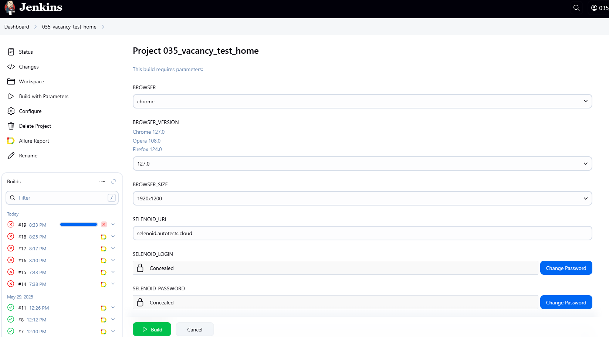
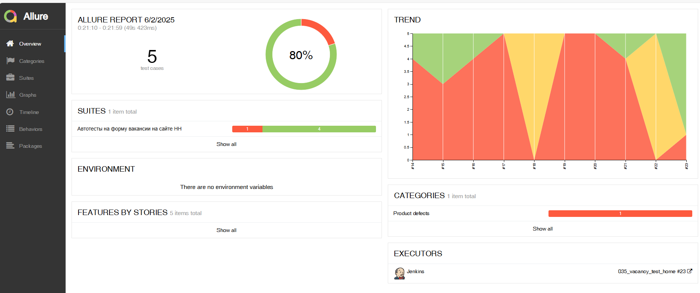
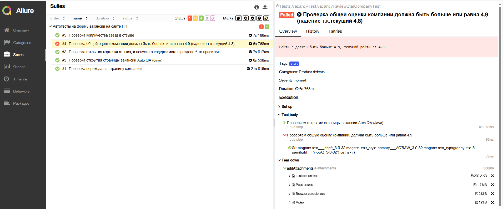
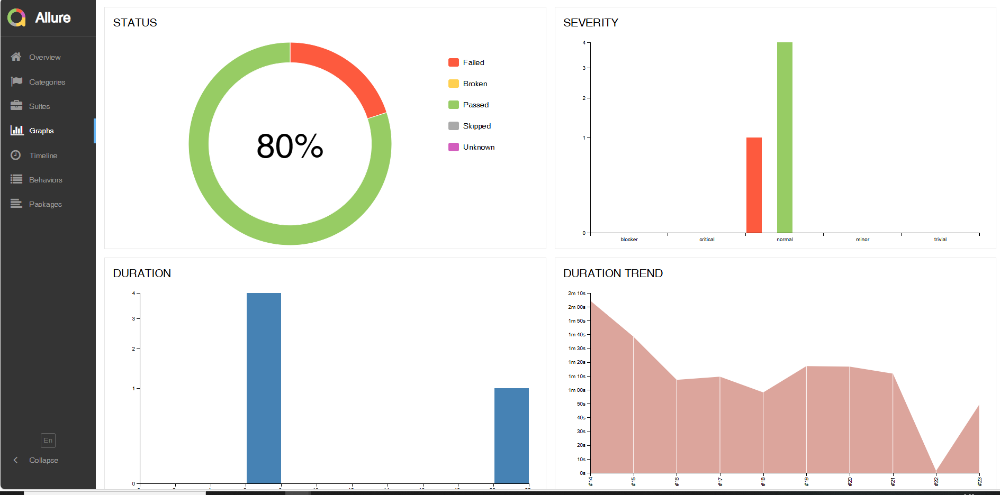
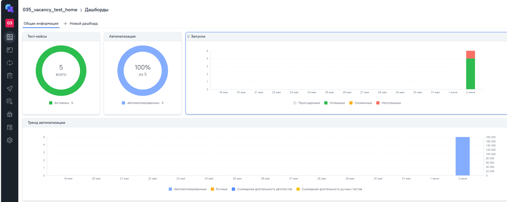
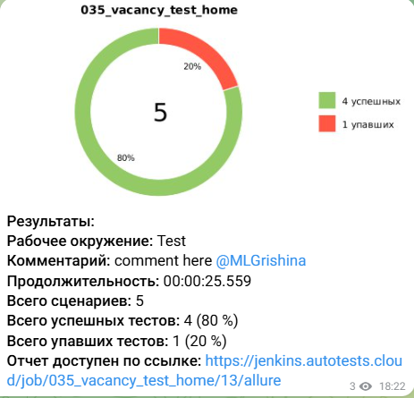
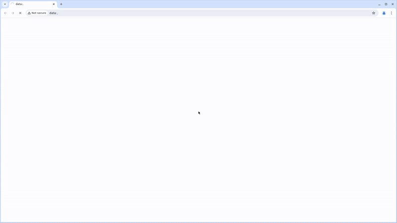

<p align="center"> 
  
</p>

<div align="center">
  <h3>ПРОЕКТ ПО АВТОМАТИЗАЦИИ ДЛЯ САЙТА КОМПАНИИ</h3>
  <a href="https://offer-now.ru/" title="Официальный сайт" style="color: #0066cc; font-size: 1.25rem; font-weight: 600; text-decoration: none;">
    OFFER NOW
  </a>
</div>

## :scroll: Содержание:

- [Используемый стек](#используемый-стек)
- [Запуск автотестов](#запуск-автотестов)
- [Сборка в Jenkins](#сборка-в-jenkins)
- [Пример Allure-отчета](#пример-allure-отчета)
- [Интеграция](#Интеграция)
- [Уведомления в Telegram](#уведомления-в-telegram)
- [Видео примера запуска тестов](#видео-примера-запуска-тестов)

<a id="используемый-стек"></a>
# :computer: Используемый стек

<p align="center">


<!---->
</p>

Тесты в данном проекте написаны на языке <code>Java</code> с использованием фреймворка для тестирования [Selenide](https://selenide.org/), сборщик - <code>Gradle</code>. <code>JUnit 5</code> задействован в качестве фреймворка модульного тестирования.
При прогоне тестов для запуска браузеров используется [Selenoid](https://aerokube.com/selenoid/).
Для удаленного запуска реализована джоба в <code>Jenkins</code> с формированием Allure-отчета и отправкой результатов в <code>Telegram</code> при помощи бота. Так же реализована интеграция с <code>Allure TestOps</code> и <code>Jira</code>.

Содержание Allure-отчета:
* Шаги теста;
* Скриншот страницы на последнем шаге;
* Page Source;
* Логи браузерной консоли;
* Видео выполнения автотеста.

<a id="запуск-автотестов"></a>
# :arrow_forward: Запуск автотестов

# Запуск тестов из терминала
```
gradle clean 
all_test 
-Dbrowser=chrome 
-DbrowserVersion=127.0 
-DbrowserSize=1920x1200 
-DselenoidUrl=selenoid.autotests.cloud 
```
При выполнении данной команды в терминале IDE тесты запустятся удаленно в <code>Selenoid</code>.


<a id="сборка-в-jenkins"></a>
<p align="center"> 

#  Сборка в Jenkins

</p>


Для запуска сборки необходимо перейти в раздел <code> Build with Parameters:</code> и нажать кнопку <code>Build</code>.
<p align="center">


</p>

После выполнения сборки, в блоке <code>История сборок</code> напротив номера сборки появятся значки <code>Allure Report</code>, при клике на которую откроется страница с сформированным отчетом.

<a id="пример-allure-отчета"></a>
<p align="center">

#  Пример Allure-отчета


## 📊 Allure Report Insights

### 🔍 Overview
<p align="center">
  <a href="https://jenkins.autotests.cloud/job/035_vacancy_test_home/23/allure/#" target="_blank" rel="noopener noreferrer">
    
  </a>
  <br>
  <a href="https://jenkins.autotests.cloud/job/035_vacancy_test_home/23/allure/#" target="_blank" rel="noopener noreferrer" style="display: inline-block; margin-top: 10px; padding: 8px 16px; background-color: #01fdfa; color: white; text-decoration: none; border-radius: 4px; font-weight: bold;">
    🚀 Открыть полный отчёт
  </a>
</p>

### Suites

### 📂 Test Suites
<p align="center">
  <a href="https://jenkins.autotests.cloud/job/035_vacancy_test_home/23/allure/#suites/a657a03f5cf0e7f2aa2f3b2cec09b6fd/e16f0f1c4492a626/" target="_blank" rel="noopener noreferrer">
    
  </a>
  <br>
  <a href="https://jenkins.autotests.cloud/job/035_vacancy_test_home/23/allure/#suites/a657a03f5cf0e7f2aa2f3b2cec09b6fd/e16f0f1c4492a626/" target="_blank" rel="noopener noreferrer" style="display: inline-block; margin-top: 10px; padding: 8px 16px; background-color: #6a5acd; color: white; text-decoration: none; border-radius: 4px; font-weight: bold;">
    🔎 Детализация тест-сьютов
  </a>
</p>

### 📈 Test Analytics
<p align="center">
  <a href="https://jenkins.autotests.cloud/job/035_vacancy_test_home/23/allure/#graph" target="_blank" rel="noopener noreferrer">
    
  </a>
  <br>
  <a href="https://jenkins.autotests.cloud/job/035_vacancy_test_home/23/allure/#graph" target="_blank" rel="noopener noreferrer" style="display: inline-block; margin-top: 10px; padding: 8px 16px; background-color: #2e8b57; color: white; text-decoration: none; border-radius: 4px; font-weight: bold;">
    📊 Анализ выполнения тестов
  </a>
</p>


<a id="Интеграция"></a>

#  Интеграция с Allure TestOps

### 📈 Аналитика тестов в Allure TestOps

<p align="center">
   <br>

 <br>
  <a href="https://allure.autotests.cloud/project/4774/dashboards" target="_blank" style="background-color:#00B4A0;color:white;padding:10px 24px;border-radius:6px;text-decoration:none;font-weight:600;margin-top:16px;display:inline-block;">
    Открыть в Allure TestOps
  </a>
</p>

<a id="уведомления-в-telegram"></a>

#  Результат выполнения автотестов


После завершения сборки специальный бот, созданный в <code>Telegram</code>, автоматически обрабатывает и отправляет сообщение с отчетом о прогоне тестов.

<p align="center">

</p>


<a id="видео-примера-запуска-тестов"></a>

#  Видео примера запуска тестов в Selenoid


В отчетах Allure для каждого теста прикреплен не только скриншот, но и видео прохождения теста


<p align="center">
  
</p>
