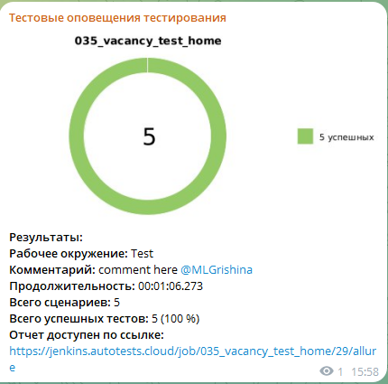

<p align="center"> 
  
</p>

<p align="center">
  Проект по автоматизации для сайта компании <br>
  <a href="https://example.com" style="color: #05f2fa;>Offer Now</a>
</p>


## :scroll: Содержание:

- [Используемый стек](#computer-используемый-стек)
- [Запуск автотестов](#arrow_forward-запуск-автотестов)
- [Сборка в Jenkins](#-сборка-в-jenkins)
- [Пример Allure-отчета](#-пример-allure-отчета)
- [Уведомления в Telegram](#-уведомления-в-telegram)
- [Видео примера запуска тестов в Selenoid](#-видео-примера-запуска-теста-в-selenoid)

### :computer: Используемый стек

<p align="center">


<!---->
</p>

Тесты в данном проекте написаны на языке <code>Java</code> с использованием фреймворка для тестирования [Selenide](https://selenide.org/), сборщик - <code>Gradle</code>. <code>JUnit 5</code> задействован в качестве фреймворка модульного тестирования.
При прогоне тестов для запуска браузеров используется [Selenoid](https://aerokube.com/selenoid/).
Для удаленного запуска реализована джоба в <code>Jenkins</code> с формированием Allure-отчета и отправкой результатов в <code>Telegram</code> при помощи бота. Так же реализована интеграция с <code>Allure TestOps</code> и <code>Jira</code>.

Содержание Allure-отчета:
* Шаги теста;
* Скриншот страницы на последнем шаге;
* Page Source;
* Логи браузерной консоли;
* Видео выполнения автотеста.

## :arrow_forward: Запуск автотестов

### Запуск тестов из терминала
```
gradle clean 
all_test 
-Dbrowser=chrome 
-DbrowserVersion=127.0 
-DbrowserSize=1920x1200 
-DselenoidUrl=selenoid.autotests.cloud 
```
При выполнении данной команды в терминале IDE тесты запустятся удаленно в <code>Selenoid</code>.


<p align="center"> 

##  Сборка в Jenkins

</p>


Для запуска сборки необходимо перейти в раздел <code> Build with Parameters:</code> и нажать кнопку <code>Build</code>.
<p align="center">


</p>

После выполнения сборки, в блоке <code>История сборок</code> напротив номера сборки появятся значки <code>Allure Report</code>, при клике на которую откроется страница с сформированным отчетом.

<p align="center">

##  Пример Allure-отчета
### Overview

</p>

<p align="center">

</p>


<p align="center">

</p>

### Результат выполнения автотестов


После завершения сборки специальный бот, созданный в <code>Telegram</code>, автоматически обрабатывает и отправляет сообщение с отчетом о прогоне тестов.

<p align="center">

</p>

###  Видео примера запуска тестов в Selenoid

В отчетах Allure для каждого теста прикреплен не только скриншот, но и видео прохождения теста


<p align="center">
  
</p>
